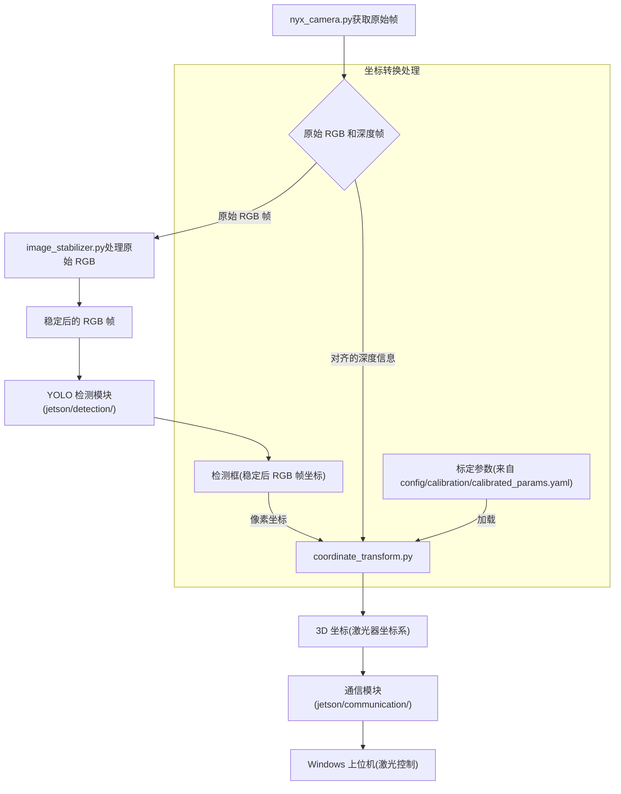

# `camera` 模块

此目录包含与 NYX 660 RGB-D 相机交互、处理其原始数据以及基于相机输出执行几何转换的代码。

## 文件说明

* `nyx_camera.py`:
  
    该文件封装了与 NYX 660 相机 SDK (`scepter-sdk`) 的交互。它负责连接相机、配置参数（如曝光时间、帧率）、启动和停止数据流、获取同步并对齐的 RGB 和深度图像帧。它还提供方法来从设备获取相机出厂的内参和畸变参数（参考 `DeviceParamSetGet` 例程），以及获取 RGB 和深度传感器之间的相对姿态（SDK 在内部用于对齐）。

* `image_stabilizer.py`:
  
    实现电子图像稳定 (EIS) 算法。它处理来自相机的原始 RGB 图像流，以补偿相机抖动和震动，为后续处理（如目标检测）提供更稳定的图像流。这里可以实现各种方法（基于特征点、基于光流）。

* `coordinate_transform.py`:
  
    处理所有必要的几何转换，将 RGB 图像中的 2D 像素位置（及其对应的深度信息）转换为相对于激光器系统的 3D 物理世界坐标。它使用相机内参和畸变参数，以及从标定文件加载的相机坐标系到激光器坐标系的外部参数（位姿 R 和 T）。

## 该模块内的工作流程

1. `nyx_camera.py` 从相机获取原始的 RGB 和深度帧。
2. `image_stabilizer.py` 处理原始 RGB 帧以生成稳定后的 RGB 帧。
3. 稳定后的 RGB 帧被传递给 YOLO 检测模块（在 `jetson/detection/` 中）。
4. 一旦 YOLO 返回检测框（在稳定后的 RGB 帧像素坐标系中），`coordinate_transform.py` 将使用这些像素坐标以及对齐的深度信息（从 `nyx_camera.py` 获取）和加载的标定参数来计算在激光器坐标系中对应的 3D 坐标。
5. 计算出的激光器坐标随后被传递给通信模块（在 `jetson/communication/` 中），以便发送到 Windows 上位机进行激光控制。

## 标定

标定数据（内参、外参、畸变参数）对于 `coordinate_transform.py` 的精度至关重要。标定参数应存储在 `config/calibration/calibrated_params.yaml` 文件中，并由 `CoordinateTransformer` 类加载。

标定脚本（`scripts/calibrate_intrinsics.py` 和 `scripts/calibrate_extrinsics.py`）负责使用相机的能力（通过 `nyx_camera.py` 进行图像/数据采集）和外部标定过程来生成此 `calibrated_params.yaml` 文件。

## `camera` 模块中的标定脚本对比

在 `camera` 模块中，有两个脚本用于实现二维标定：`coordinate_transform_2d_simple.py` 和 `coordinate_transform_2d.py`。这两个脚本都旨在将激光器的像素坐标转换为物理坐标，但它们的实现方式和用户体验有一定差异。
这两个脚本都实现了像素坐标到激光器物理坐标的二维标定，但在交互方式、流程设计、功能细节和用户体验等方面有明显差异。下面对比说明：

---

### 1. 标定点的选择方式

* coordinate_transform_2d_simple.py
  * 标定点是预设的（如四个角点），用户不能自由点击选择。
  * 用户需按顺序将激光器打到高亮点，并在命令行输入物理坐标。
  * 适合快速、标准化的标定场景，减少人为误差，但灵活性较低。

* coordinate_transform_2d.py
  * 标定点由用户在图像窗口自由点击选择，数量和位置都可自定（至少4个）。
  * 每点击一个点后，用户需输入对应的激光器物理坐标。
  * 灵活性高，适合实际场景中标定区域不规则或需多点标定的需求。

### 2. 用户交互流程

* coordinate_transform_2d_simple.py
  * 以菜单驱动，分为“标定模式”和“测试模式”。
  * 标定流程线性，按'n'切换下一个点，按'q'退出。
  * 测试模式下，点击图像任意点，命令行显示预测物理坐标。

* coordinate_transform_2d.py
  * 主要通过窗口和键盘交互：
    * 鼠标左键点击选点
    * 'c'键撤销上一个点
    * 's'键保存并计算
    * 'q'键退出
  * 标定完成后可选择进入测试模式，测试模式下点击任意点显示预测坐标。

### 3. 数据保存与复用

* coordinate_transform_2d_simple.py
  * 没有直接实现标定结果的保存功能（如保存到文件），仅在内存中保存。

* coordinate_transform_2d.py
  * 标定完成后会将单应性矩阵和点对信息保存到 YAML 文件，便于后续复用和追溯。
  * 支持加载和更新已有的标定文件。

### 4. 功能细节

* coordinate_transform_2d_simple.py
  * 代码结构更适合“流程演示”或“教学”，流程固定，易于理解。

* coordinate_transform_2d.py
  * 功能更完善，支持点的撤销、数据保存、标定点数量自定义等。
  * 更适合实际工程应用和多次标定。

### 5. 测试模式

* 两者都支持测试模式，即点击图像任意点，显示预测的激光器物理坐标。
* 实现方式略有不同，但核心思路一致。

### 6. 代码结构与可扩展性

* coordinate_transform_2d_simple.py
  * 结构简单，流程清晰，适合入门和快速实验。
  * 灵活性和可扩展性较弱。

* coordinate_transform_2d.py
  * 结构更复杂，功能更丰富，便于扩展和集成到更大的系统中。
  * 更适合实际项目和长期维护。

总结表

| 功能点 | coordinate_transform_2d_simple.py | coordinate_transform_2d.py |
|--------|----------------------------------|---------------------------|
| 标定点选择 | 固定预设点 | 用户自由点击 |
| 点数 | 固定（如4个） | 任意（≥4个） |
| 点撤销 | 不支持 | 支持 |
| 数据保存 | 不支持 | 支持 YAML 保存 |
| 测试模式 | 支持 | 支持 |
| 交互方式 | 菜单+命令行+窗口 | 窗口+键盘+命令行 |
| 适用场景 | 快速演示/标准化 | 实际工程/灵活标定 |
