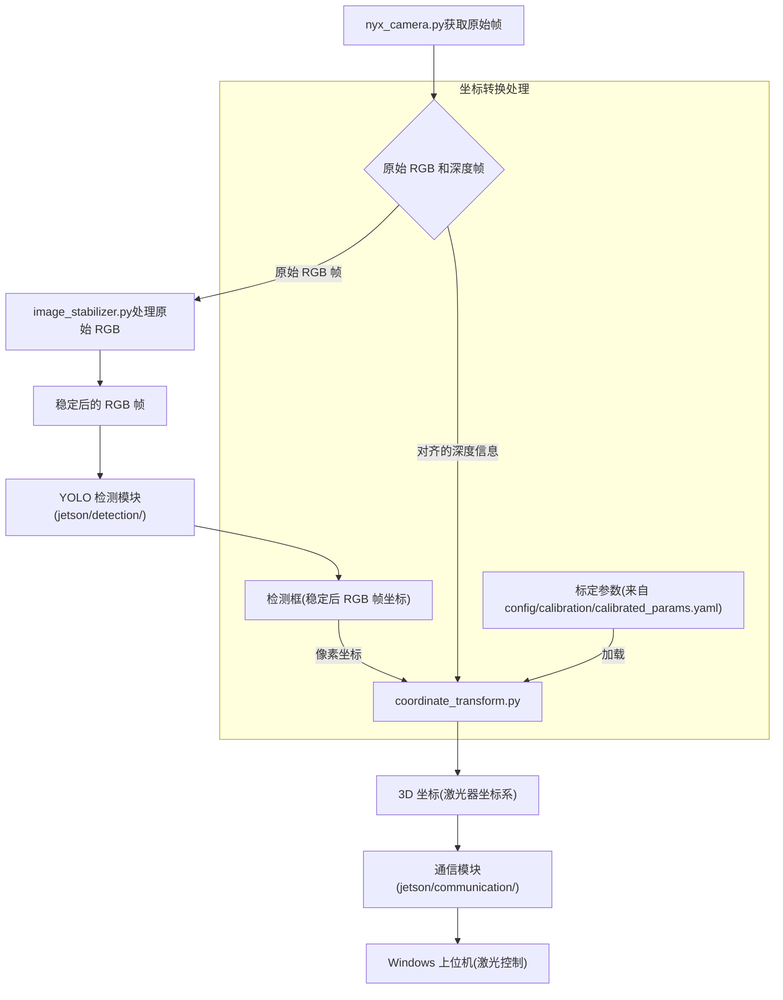

# `camera` 模块

此目录包含与 NYX 660 RGB-D 相机交互、处理其原始数据以及基于相机输出执行几何转换的代码。

## 文件说明

* `nyx_camera.py`:
  
    该文件封装了与 NYX 660 相机 SDK (`scepter-sdk`) 的交互。它负责连接相机、配置参数（如曝光时间、帧率）、启动和停止数据流、获取同步并对齐的 RGB 和深度图像帧。它还提供方法来从设备获取相机出厂的内参和畸变参数（参考 `DeviceParamSetGet` 例程），以及获取 RGB 和深度传感器之间的相对姿态（SDK 在内部用于对齐）。

* `image_stabilizer.py`:
  
    实现电子图像稳定 (EIS) 算法。它处理来自相机的原始 RGB 图像流，以补偿相机抖动和震动，为后续处理（如目标检测）提供更稳定的图像流。这里可以实现各种方法（基于特征点、基于光流）。

* `coordinate_transform.py`:
  
    处理所有必要的几何转换，将 RGB 图像中的 2D 像素位置（及其对应的深度信息）转换为相对于激光器系统的 3D 物理世界坐标。它使用相机内参和畸变参数，以及从标定文件加载的相机坐标系到激光器坐标系的外部参数（位姿 R 和 T）。

## 该模块内的工作流程

1. `nyx_camera.py` 从相机获取原始的 RGB 和深度帧。
2. `image_stabilizer.py` 处理原始 RGB 帧以生成稳定后的 RGB 帧。
3. 稳定后的 RGB 帧被传递给 YOLO 检测模块（在 `jetson/detection/` 中）。
4. 一旦 YOLO 返回检测框（在稳定后的 RGB 帧像素坐标系中），`coordinate_transform.py` 将使用这些像素坐标以及对齐的深度信息（从 `nyx_camera.py` 获取）和加载的标定参数来计算在激光器坐标系中对应的 3D 坐标。
5. 计算出的激光器坐标随后被传递给通信模块（在 `jetson/communication/` 中），以便发送到 Windows 上位机进行激光控制。

## 标定

标定数据（内参、外参、畸变参数）对于 `coordinate_transform.py` 的精度至关重要。标定参数应存储在 `config/calibration/calibrated_params.yaml` 文件中，并由 `CoordinateTransformer` 类加载。

标定脚本（`scripts/calibrate_intrinsics.py` 和 `scripts/calibrate_extrinsics.py`）负责使用相机的能力（通过 `nyx_camera.py` 进行图像/数据采集）和外部标定过程来生成此 `calibrated_params.yaml` 文件。
